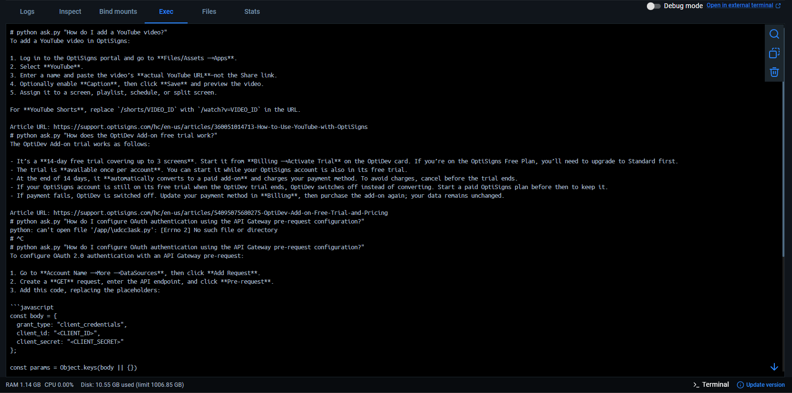

# Amber Atlas

A Dockerized support assistant that scrapes OptiSigns help articles, stores them as Markdown, uploads new or changed files to an existing OpenAI Vector Store, and answers questions with File Search.

## Setup

Requirements: Git and Docker Desktop using Linux containers.

```powershell
git clone <repository-url> amber-atlas
cd amber-atlas
Copy-Item .env.sample .env
```

Create an OpenAI Vector Store manually, then edit `.env`:

```env
OPENAI_API_KEY=your_api_key
OPENAI_VECTOR_STORE_ID=vs_xxxxxxxxx
OPENAI_MODEL=your_model
```

Start the dashboard and daily service:

```powershell
docker compose up -d --build
```

Open [http://localhost:8080](http://localhost:8080).

## Local usage

Run commands inside Docker Desktop under **Containers → amber-atlas → app → Exec**:

```sh
# Scrape 30 articles to data/articles/ (no OpenAI upload)
python main.py --scrape-only --limit 30

# Scrape all articles and upload only new or changed files
python main.py

# Upload existing local Markdown files only
python main.py --upload-only --limit 30

# Ask the assistant
python ask.py "How do I add a YouTube video?"

# Run tests
python -m unittest discover -s tests -v
```

The dashboard also provides **Scrape all**, **Sync all**, article preview, Vector Store file listing, and chat. Sync uses SHA-256 hashes in `data/upload-state.json` to classify files as `added`, `updated`, or `skipped`.

## Daily job and logs

The `daily` container runs the pipeline every day at 02:00 UTC (09:00 Vietnam time). Configure `DAILY_HOUR_UTC` and `DAILY_MINUTE_UTC` in `compose.yaml`.

```powershell
docker compose logs -f daily
```

Job artefacts are written to [`logs/`](./logs/): `last-run.json`, timestamped `.log`, and timestamped `.json` files. Docker Desktop must be running at the scheduled time.

## Demo



Never commit `.env`. After changing source code or environment variables, rebuild with:

```powershell
docker compose up -d --build
```
